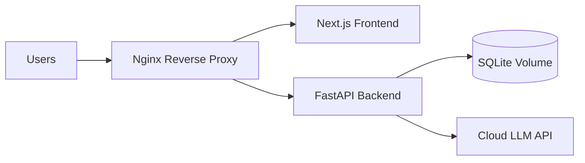

# Production Deployment Guide

## Architecture



## What This Deployment Supports

- Frontend served as a website behind Nginx.
- Backend behind the same origin at `/api`.
- Cloud-hosted model providers via `DEFAULT_MODEL_PROVIDER` and API keys.
- Persistent SQLite storage via Docker volumes.
- Security headers, upload validation, and stricter origin handling.

## Required Environment Variables

- `JWT_SECRET_KEY`
- `DEFAULT_MODEL_PROVIDER` set to `openai`, `gemini`, or `anthropic`
- `OPENAI_API_KEY`, `GOOGLE_AI_API_KEY`, or `ANTHROPIC_API_KEY`
- `FRONTEND_URL`
- `ALLOWED_ORIGINS`

## Recommended Production Values

- `DATABASE_PATH=/data/health_records.db`
- `ENCRYPTION_KEY_PATH=/data/.encryption_key`
- `WEB_CONCURRENCY=2` or higher depending on CPU
- `NEXT_PUBLIC_API_URL=` blank when frontend and backend share the same origin

## Build and Run

```bash
cp .env.example .env
docker compose build
docker compose up -d
```

## Endpoints

- Frontend: `http://your-host/`
- API: `http://your-host/api/health`
- Docs: `http://your-host/docs` if enabled by the backend route

## Operational Notes

- Keep `data/` backed by a persistent volume or managed storage.
- Rotate `JWT_SECRET_KEY` if credentials are compromised.
- Prefer a cloud LLM provider for production deployments.
- For high availability, place this stack behind a managed load balancer and terminate TLS there or at Nginx.

## If Your Budget Is Zero

Use [FREE_DEPLOYMENT.md](d:/ai-doctor-v3/FREE_DEPLOYMENT.md) instead of this guide. The production guide assumes paid infrastructure or a stable cloud host.
