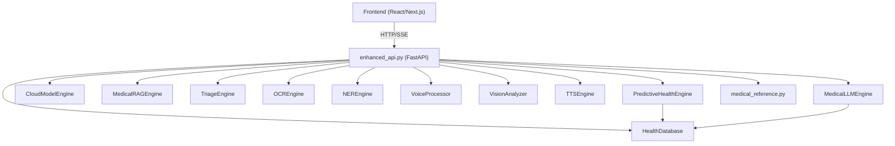

# AI Doctor v3 — Complete Codebase Architecture

> Every class, every function chain, every DSA & OOP pattern explained.

---

## System Overview



---

## 1. [enhanced_api.py](file:///d:/ai-doctor-v3/enhanced_api.py) — The Orchestrator

**Role**: FastAPI application that wires all services together. Every frontend request hits this file first.

### Key Patterns
| Pattern | Usage |
|---------|-------|
| **Dependency Injection** | All service classes instantiated at module level, injected into endpoints |
| **Strategy Pattern** | [chat_stream](file:///d:/ai-doctor-v3/enhanced_api.py#150-340) routes to `llm_engine` or `cloud_engine` based on [model_provider](file:///d:/ai-doctor-v3/enhanced_api.py#140-149) |
| **Server-Sent Events** | `StreamingResponse` yields `data: {json}\n\n` chunks for real-time chat |

### Function Call Chain (Chat Flow)
```
POST /api/chat/stream
  → TriageEngine.assess(message)           # classify urgency
  → MedicalRAGEngine.get_context_for_query()  # retrieve medical knowledge
  → HealthDatabase.get_patient_context()    # load patient history
  → HealthDatabase.get_conversation()       # load chat history
  → MedicalLLMEngine.generate_streaming()   # OR CloudModelEngine.stream()
  → HealthDatabase.save_message()           # persist to DB
  → TTSEngine.generate_speech()            # optional audio
```

### Endpoint Map (50+ endpoints)
| Category | Key Endpoints |
|----------|--------------|
| **Chat** | `POST /api/chat/stream`, `POST /api/chat/specialist/stream` |
| **Patient** | `PUT /api/patient/{id}`, `GET /api/patient/{id}/dashboard` |
| **Labs** | `POST /api/lab-results/{id}`, `POST /api/ocr/lab-report` |
| **Health** | `GET /api/patient/{id}/health-trajectory`, `GET /api/patient/{id}/health-score` |
| **Voice** | `POST /api/voice/transcribe`, `POST /api/tts/generate` |
| **Tools** | `POST /api/drug-interactions`, `POST /api/symptom-flow/*`, `GET /api/model-providers` |

---

## 2. [services/database.py](file:///d:/ai-doctor-v3/services/database.py) — HealthDatabase

**OOP**: Single class [HealthDatabase](file:///d:/ai-doctor-v3/services/database.py#62-654) encapsulating all CRUD operations.

### DSA & Patterns
| Concept | Where |
|---------|-------|
| **Singleton per thread** | `threading.local()` for connection pooling — each thread gets its own `sqlite3.Connection` |
| **Hash Map (dict)** | [get_latest_vitals()](file:///d:/ai-doctor-v3/services/database.py#406-422) builds a `{test_name: latest_record}` map using dict dedup |
| **Encryption Decorator Pattern** | [_encrypt_patient_fields()](file:///d:/ai-doctor-v3/services/database.py#228-235) / [_decrypt_patient_row()](file:///d:/ai-doctor-v3/services/database.py#236-243) wrap Fernet around PHI fields |
| **Index (B-Tree)** | 7 SQL indexes on foreign keys + timestamps for O(log n) lookups |
| **Migration Pattern** | `ALTER TABLE` in [_init_schema()](file:///d:/ai-doctor-v3/services/database.py#85-225) for backward-compatible schema evolution |

### Tables (7 total)
[patients](file:///d:/ai-doctor-v3/enhanced_api.py#732-735) → [sessions](file:///d:/ai-doctor-v3/services/database.py#294-300) → [messages](file:///d:/ai-doctor-v3/services/memory_manager.py#410-453) (1:N:N chain)
`health_events`, [lab_results](file:///d:/ai-doctor-v3/enhanced_api.py#780-783), `medical_images`, [medications](file:///d:/ai-doctor-v3/services/database.py#597-606), `medication_logs`

### Encryption
- **Algorithm**: Fernet (AES-128-CBC + HMAC-SHA256)
- **Encrypted fields**: [name](file:///d:/ai-doctor-v3/enhanced_api.py#1952-1972), `allergies`, `chronic_conditions`, `family_history`, `emergency_contact`
- **Key storage**: [data/.encryption_key](file:///d:/ai-doctor-v3/data/.encryption_key) (auto-generated on first run)

---

## 3. [services/services_llm_engine.py](file:///d:/ai-doctor-v3/services/services_llm_engine.py) — MedicalLLMEngine + CloudModelEngine

### MedicalLLMEngine
**OOP**: Central LLM orchestrator. Manages conversation context, prompt engineering, system prompt.

| DSA / Pattern | Where |
|---------------|-------|
| **Sliding Window** | `conversation_history[-N:]` limits context to last N messages |
| **Template Method** | `SYSTEM_PROMPT` is a class-level constant template injected into every request |
| **Builder Pattern** | `_build_messages()` constructs the `[system, user, assistant, ...]` message array |
| **Streaming Iterator** | `generate_streaming()` yields token-by-token via `requests` chunked response |
| **String Accumulator** | Response tokens accumulated with `+=` into full response string |

### CloudModelEngine
**OOP**: Strategy pattern — same interface, different backends.

| Method | Backend |
|--------|---------|
| [_stream_openai()](file:///d:/ai-doctor-v3/services/services_llm_engine.py#715-741) | OpenAI GPT-4o via `httpx` async SSE |
| [_stream_gemini()](file:///d:/ai-doctor-v3/services/services_llm_engine.py#742-777) | Google Gemini via REST SSE |
| [_stream_anthropic()](file:///d:/ai-doctor-v3/services/services_llm_engine.py#778-816) | Anthropic Claude via `httpx` async SSE |
| [get_available_providers()](file:///d:/ai-doctor-v3/services/services_llm_engine.py#659-668) | Checks which API keys exist in `os.environ` |

---

## 4. [services/rag_engine.py](file:///d:/ai-doctor-v3/services/rag_engine.py) — MedicalRAGEngine

**OOP**: Encapsulates FAISS vector search with lazy initialization.

### DSA & Algorithms
| Concept | Implementation |
|---------|---------------|
| **Vector Similarity Search** | FAISS `IndexFlatIP` — inner product (cosine similarity on normalized vectors) |
| **Sliding Window Chunking** | [_chunk_text()](file:///d:/ai-doctor-v3/services/rag_engine.py#40-54) — 300-token chunks with 50-token overlap for retrieval accuracy |
| **Embedding** | `SentenceTransformer("all-MiniLM-L6-v2")` — 384-dim dense embeddings |
| **Lazy Loading (Singleton)** | [_get_model()](file:///d:/ai-doctor-v3/services/rag_engine.py#27-38) module-level global ensures model loads once |
| **Deduplication (HashSet)** | `seen_conditions`, `seen_source_urls` prevent duplicate results |
| **Serialization** | FAISS index persisted as `.bin`, documents as `.json` |

### Call Chain
```
search(query) → encode query → FAISS.search(top_k) → return ranked docs with sources
get_context_for_query() → search() → format as LLM-readable text with citations
get_citations_for_query() → search() → extract deduplicated citation objects
```

---

## 5. [services/triage_engine.py](file:///d:/ai-doctor-v3/services/triage_engine.py) — TriageEngine

**OOP**: Rule-based classifier using compiled regex patterns.

### DSA & Patterns
| Concept | Implementation |
|---------|---------------|
| **Compiled Regex Array** | 3 priority tiers: `EMERGENCY > URGENT > MODERATE`, each a `List[Tuple[Pattern, str]]` |
| **Priority Queue (implicit)** | Sequential scan — first match wins (emergency checked first) |
| **Multilingual** | Regex patterns include Hindi (Devanagari) and Punjabi (Gurmukhi) scripts |
| **Pre-compilation** | [_compile_patterns()](file:///d:/ai-doctor-v3/services/triage_engine.py#89-93) in [__init__](file:///d:/ai-doctor-v3/services/services_llm_engine.py#105-116) — O(1) per-match after startup |

### Triage Levels
[emergency](file:///d:/ai-doctor-v3/services/services_all_remaining.py#457-470) (🔴 call 911) → `urgent` (🟠 24h) → `moderate` (🟡 days) → `general` (🟢 home care)

---

## 6. [services/ner_engine.py](file:///d:/ai-doctor-v3/services/ner_engine.py) — NEREngine

**OOP**: Biomedical Named Entity Recognition using scispaCy models.

### DSA & Patterns
| Concept | Implementation |
|---------|---------------|
| **NLP Pipeline** | spaCy `doc.ents` iteration — token-level entity extraction |
| **Alias Hash Map** | `_DISEASE_ALIASES`, `_DRUG_ALIASES` — O(1) lookup for medical abbreviation normalization |
| **Filter Set** | `_LAB_ANALYTES` set — O(1) check to exclude lab chemicals from drug list |
| **Dedup Set** | `seen_diseases`, `seen_chemicals` prevent duplicate entities |
| **Regex Extraction** | `_MEASUREMENT_RE` finds numeric values with medical units |
| **Lazy Loading** | Two global models: [_ner_model](file:///d:/ai-doctor-v3/services/ner_engine.py#22-31) (BC5CDR) and [_sci_model](file:///d:/ai-doctor-v3/services/ner_engine.py#33-46) (general biomedical) |

### Entity Types
- **DISEASE**: diabetes, hypertension, etc. (normalized via alias map)
- **CHEMICAL**: metformin, aspirin, etc. (lab analytes filtered out)
- **MEASUREMENT**: `10.2 g/dL`, `126 mg/dL` (regex-based)

---

## 7. [services/ocr_engine.py](file:///d:/ai-doctor-v3/services/ocr_engine.py) — OCREngine

**OOP**: Multi-pass lab report parser with EasyOCR + PyMuPDF.

### DSA & Algorithms
| Concept | Implementation |
|---------|---------------|
| **4-Pass Extraction** | Pass 1: inline (same line) → Pass 2: multi-line → Pass 3: qualitative → Pass 4: descriptive |
| **Compiled Regex Dict** | `_compiled` — 70+ test patterns pre-compiled for fast matching |
| **OCR Decimal Fix** | [_ocr_decimal_fix()](file:///d:/ai-doctor-v3/services/ocr_engine.py#574-616) — brute-force decimal insertion to fix OCR errors (tries all positions) |
| **Image Preprocessing** | PIL contrast/sharpness enhancement + upscaling for better OCR |
| **PDF Strategy** | Primary: PyMuPDF text extraction → Fallback: render pages to images → OCR each page |
| **Sorted Output** | Results sorted by [test_name](file:///d:/ai-doctor-v3/enhanced_api.py#1952-1972) for consistent ordering |
| **Busy-line Detection** | `line_test_counts[]` array tracks test density per line to skip garbled tables |

### Lab Test Coverage
70+ quantitative tests (CBC, lipids, liver, kidney, thyroid, vitamins, etc.) + 15 qualitative + 6 descriptive

---

## 8. [services/services_voice_processor.py](file:///d:/ai-doctor-v3/services/services_voice_processor.py) — VoiceProcessor

**OOP**: Enterprise voice-to-text with language-specific pipelines.

### DSA & Patterns
| Concept | Implementation |
|---------|---------------|
| **Thread Pool** | `ThreadPoolExecutor(max_workers=3)` for async transcription |
| **Async/Await Bridge** | `loop.run_in_executor()` wraps sync Whisper calls for FastAPI |
| **Unicode Range Check** | [_has_gurmukhi()](file:///d:/ai-doctor-v3/services/services_voice_processor.py#37-39), [_has_devanagari()](file:///d:/ai-doctor-v3/services/services_voice_processor.py#41-43) — O(n) character scan for script detection |
| **Language Remap Map** | `lang_remap` dict corrects Whisper mis-detections (e.g., [fa](file:///d:/ai-doctor-v3/services/services_llm_engine.py#548-571) → [hi](file:///d:/ai-doctor-v3/enhanced_api.py#752-756)) |
| **Retry Pattern** | Punjabi: if first transcription has no Gurmukhi characters, re-run with strict params |
| **FFT Spectrum** | [get_audio_spectrum()](file:///d:/ai-doctor-v3/services/services_voice_processor.py#384-403) — NumPy FFT → binned frequency bars for visualization |
| **RMS Calculation** | [get_audio_level()](file:///d:/ai-doctor-v3/services/services_voice_processor.py#357-367) — root mean square of audio signal for volume detection |

---

## 9. [services/services_all_remaining.py](file:///d:/ai-doctor-v3/services/services_all_remaining.py) — TTSEngine, VisionAnalyzer, TranslationService, EmergencyDetector

### TTSEngine
| Pattern | Implementation |
|---------|---------------|
| **Strategy Pattern** | Routes to ElevenLabs API (Punjabi) or edge-tts (Hindi/English) based on language + API key |
| **Script Detection** | Unicode range checks decide voice selection |
| **Fallback Chain** | ElevenLabs → edge-tts Hindi → edge-tts English fallback |
| **File Validation** | Checks output file exists and > 512 bytes before returning URL |

### VisionAnalyzer
| Pattern | Implementation |
|---------|---------------|
| **BLIP Image Captioning** | `BlipForConditionalGeneration` generates captions from medical images |
| **Image Classification** | Pixel stats (grayscale, mean, edge detection) classify: X-ray vs document vs photo |
| **Multiple Prompts** | Generates unconditional + 2 conditional captions for richer analysis |

### EmergencyDetector
| Pattern | Implementation |
|---------|---------------|
| **Linear Scan** | Simple keyword matching against 50+ emergency phrases (EN + HI + PA) |

---

## 10. [services/predictive_health.py](file:///d:/ai-doctor-v3/services/predictive_health.py) — PredictiveHealthEngine

**OOP**: Time-series analysis engine for health trajectory prediction.

### DSA & Algorithms
| Concept | Implementation |
|---------|---------------|
| **Linear Regression** | Custom [_linear_regression()](file:///d:/ai-doctor-v3/services/predictive_health.py#88-117) — least squares (slope, intercept, R²) |
| **Time-Series Projection** | Projects lab values forward 30/60/90 days using regression slope |
| **Intervention Window** | Calculates days until value crosses critical threshold |
| **Rate of Change** | `slope` = change per day, classified as rapid/moderate/slow |
| **Acceleration** | Compares first-half slope vs second-half slope to detect trend changes |
| **Critical Thresholds** | `CRITICAL_THRESHOLDS` dict — 25+ tests with (critical_low, low, high, critical_high) |
| **Alert Level Classification** | green → yellow → orange → red based on trajectory severity |

### Requirements
- Minimum 2 data points of the same test
- Minimum 3 days between first and last reading

---

## 11. [services/medical_reference.py](file:///d:/ai-doctor-v3/services/medical_reference.py) — Static Medical Knowledge

**Not OOP** — pure functional module with large data constants + utility functions.

### Data Structures
| Structure | Size | Purpose |
|-----------|------|---------|
| `LAB_TEST_CATALOG` (List[Dict]) | 170+ entries | Lab test metadata: name, unit, normal range, category |
| `LAB_CATALOG_MAP` (Dict) | O(1) lookup | name → catalog entry hash map |
| `SPECIALIST_PROMPTS` (Dict) | 12 specialists | Persona prompts for specialist mode |
| `RISK_RULES` (Dict) | 10 diseases | Weighted risk factor rules |
| `LAB_CORRELATION_RULES` (List) | 10 patterns | Cross-test correlation detection |
| `ORGAN_HEALTH_RULES` (Dict) | 9 organs | Organ-level health scoring |
| `SCREENING_GUIDELINES` (List) | 19 items | Age/gender-based screening recommendations |
| `MEDICINE_CATALOG` (List) | 100+ drugs | Drug database with dosages |

### Key Functions
| Function | Algorithm |
|----------|-----------|
| [compute_risk_scores()](file:///d:/ai-doctor-v3/services/medical_reference.py#527-569) | Weighted sum of triggered risk factors → percentage |
| [compute_organ_scores()](file:///d:/ai-doctor-v3/services/medical_reference.py#571-601) | `100 - (abnormal/matched) * 60` per organ |
| [compute_lab_correlations()](file:///d:/ai-doctor-v3/services/medical_reference.py#603-636) | Pattern matching across multiple tests (min_matches threshold) |
| [detect_trends()](file:///d:/ai-doctor-v3/services/medical_reference.py#638-691) | First-half vs second-half average comparison for trend direction |
| [get_screening_plan()](file:///d:/ai-doctor-v3/services/medical_reference.py#693-709) | Filter guidelines by age + gender |
| [search_medicines()](file:///d:/ai-doctor-v3/services/medical_reference.py#872-891) | Substring search across medicine catalog |

---

## 12. [services/memory_manager.py](file:///d:/ai-doctor-v3/services/memory_manager.py) — MemoryManager (DEPRECATED)

Legacy conversation storage. **Superseded by [HealthDatabase](file:///d:/ai-doctor-v3/services/database.py#62-654)**. Kept for backward compatibility.

---

## 13. Frontend — [frontend_EnhancedMedicalChat.jsx](file:///d:/ai-doctor-v3/frontend/components/frontend_EnhancedMedicalChat.jsx)

**5,100+ lines** — single-file React component with everything embedded.

### OOP Concepts (React)
| Concept | Implementation |
|---------|---------------|
| **Memoization** | `React.memo()` on `RobotDoc`, `MessageBubble` — prevents re-renders |
| **Custom Hooks** | `useState`, `useCallback`, `useRef`, `useEffect`, `useMemo` |
| **Observer Pattern** | `useEffect` watchers on `patientId`, [messages](file:///d:/ai-doctor-v3/services/memory_manager.py#410-453), `isDark` |
| **Strategy Pattern** | `genMode` (fast/balanced/detailed), `selectedModel` (core/openai/gemini/anthropic) |
| **State Machine** | [tab](file:///d:/ai-doctor-v3/services/memory_manager.py#45-119) state drives which view renders (chat, tools, senior mode) |

### DSA in Frontend
| Concept | Where |
|---------|-------|
| **Streaming Parser** | SSE `ReadableStream` reader splits `\n`-delimited chunks, parses `data: {json}` |
| **Debounce** | Auto-play TTS waits for stream completion before playing |
| **Polling** | `setInterval(5min)` for auto risk prediction checks |
| **Array Dedup** | Toast system uses `Date.now() + Math.random()` as unique IDs |
| **Filter/Map** | Session list filtering, model provider availability display |

---

## Cross-Cutting OOP Patterns

| Pattern | Where Used |
|---------|-----------|
| **Lazy Initialization** | Every ML model: Whisper, BLIP, scispaCy, SentenceTransformer, EasyOCR |
| **Singleton** | Module-level `_model = None` globals in RAG, NER, OCR |
| **Strategy** | Multi-model chat routing, TTS voice selection, OCR PDF vs Image |
| **Template Method** | System prompt template, triage prompt template |
| **Observer** | React `useEffect` hooks, SSE streaming |
| **Builder** | Message array construction for LLM context |
| **Facade** | [enhanced_api.py](file:///d:/ai-doctor-v3/enhanced_api.py) hides 12 service classes behind clean HTTP endpoints |
| **Repository** | [HealthDatabase](file:///d:/ai-doctor-v3/services/database.py#62-654) abstracts all SQL behind method calls |
| **Decorator** | Encryption wrapping on patient fields |

## Cross-Cutting DSA Patterns

| Structure | Where Used |
|-----------|-----------|
| **Hash Map (dict)** | Lab catalog lookup, alias normalization, latest-vitals dedup, language remapping |
| **Hash Set** | Entity dedup in NER, condition dedup in RAG, found-tests tracking in OCR |
| **Array/List** | Message history, lab results, search results, toast queue |
| **Queue (implicit)** | Triage priority scanning, OCR multi-pass extraction |
| **B-Tree (SQL Index)** | 7 database indexes for O(log n) patient/session/timestamp lookups |
| **Vector Index (FAISS)** | Inner product similarity over 384-dim embeddings |
| **Linear Regression** | Health trajectory prediction |
| **Sliding Window** | Text chunking (300 tokens, 50 overlap), conversation context limiting |
| **FFT** | Audio spectrum visualization |
| **Regex Automata** | 70+ compiled patterns in OCR, 45+ in triage |
