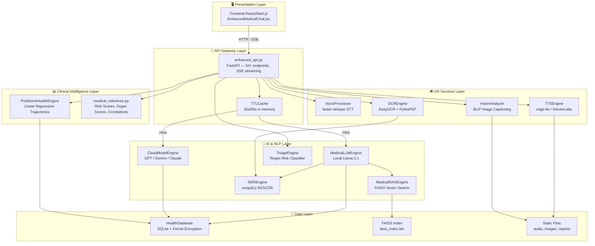
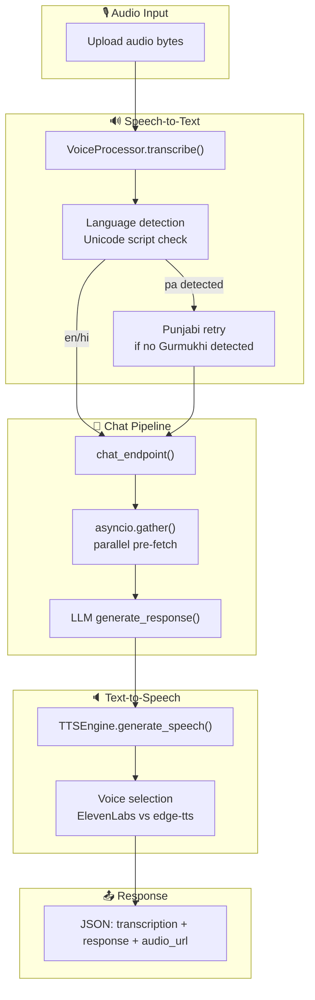
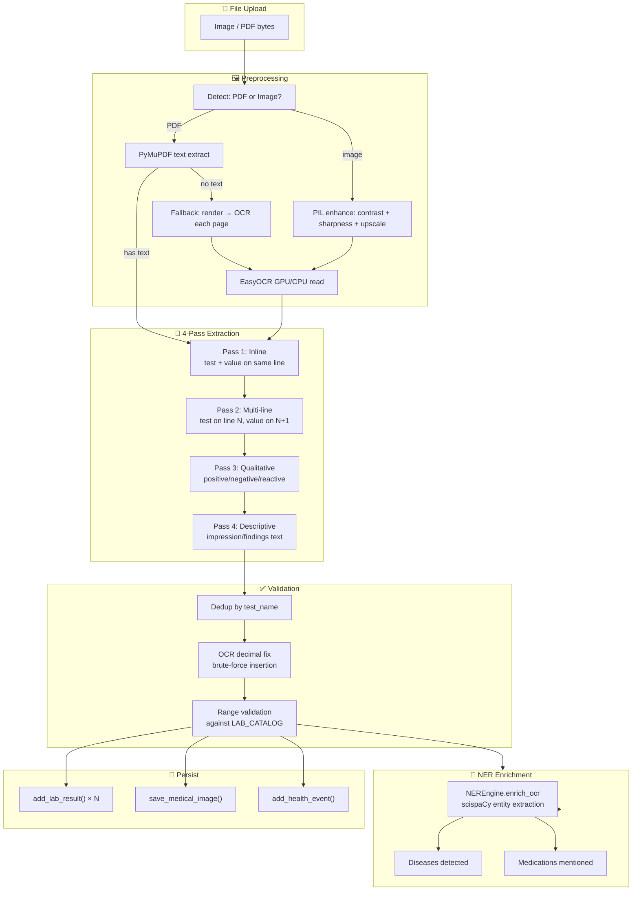
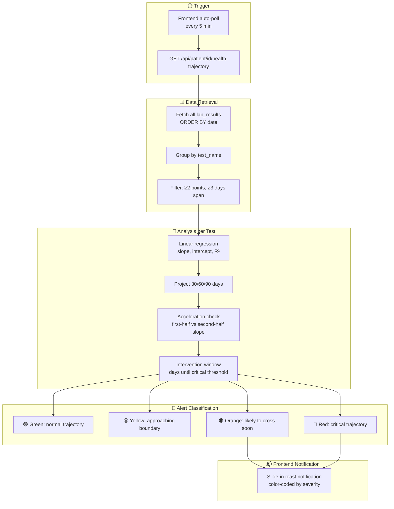
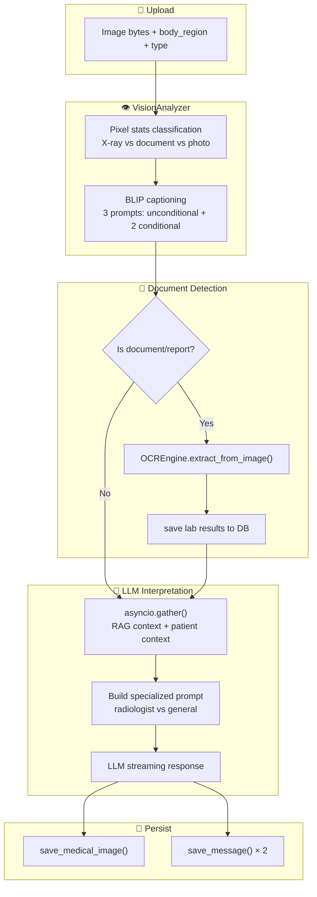
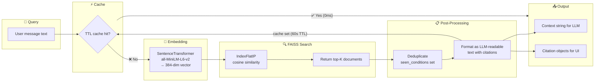
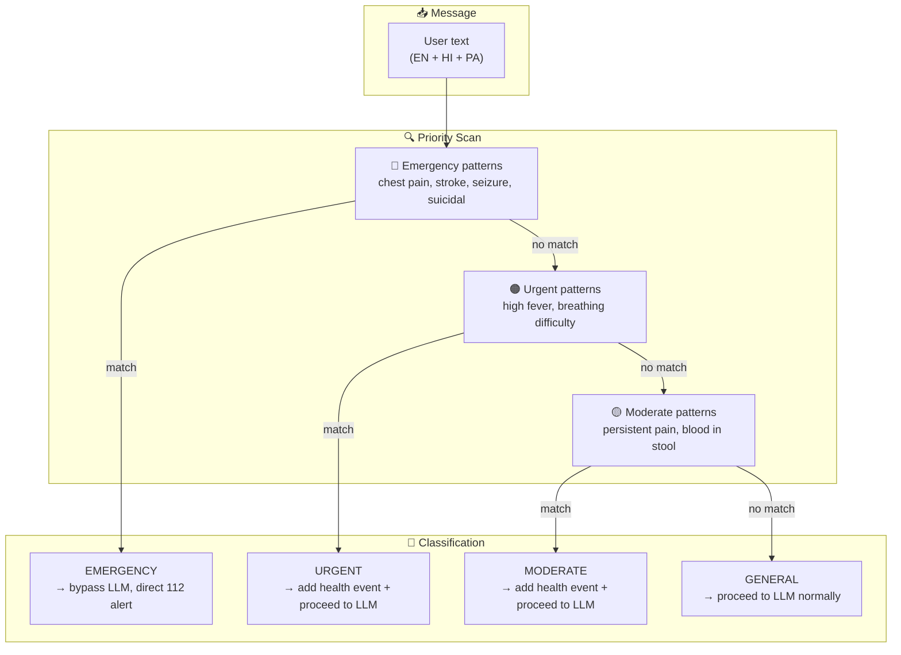
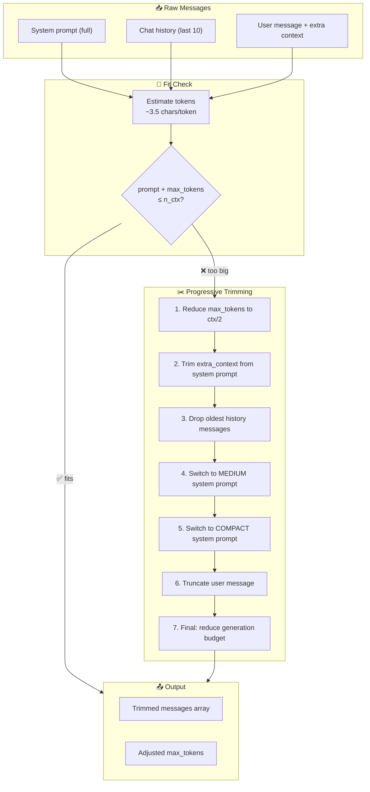

# AI Doctor v3 — Complete Codebase Architecture

> Every class, function chain, DSA & OOP pattern — plus optimized pipeline flowcharts.

---

## System Overview — Layered Architecture



### Layer Responsibilities

| Layer | Responsibility | Files |
|-------|---------------|-------|
| **Presentation** | UI rendering, SSE stream parsing, state management | [frontend_EnhancedMedicalChat.jsx](file:///d:/ai-doctor-v3/frontend/components/frontend_EnhancedMedicalChat.jsx) |
| **API Gateway** | Routing, request validation, response streaming, CORS, **caching** | [enhanced_api.py](file:///d:/ai-doctor-v3/enhanced_api.py) |
| **AI & NLP** | LLM inference, knowledge retrieval, entity extraction, triage | [services_llm_engine.py](file:///d:/ai-doctor-v3/services/services_llm_engine.py), [rag_engine.py](file:///d:/ai-doctor-v3/services/rag_engine.py), [ner_engine.py](file:///d:/ai-doctor-v3/services/ner_engine.py), [triage_engine.py](file:///d:/ai-doctor-v3/services/triage_engine.py) |
| **Clinical Intelligence** | Risk prediction, organ scoring, lab correlation, trend detection | [predictive_health.py](file:///d:/ai-doctor-v3/services/predictive_health.py), [medical_reference.py](file:///d:/ai-doctor-v3/services/medical_reference.py) |
| **I/O Services** | Voice transcription, text-to-speech, OCR, image analysis | [services_voice_processor.py](file:///d:/ai-doctor-v3/services/services_voice_processor.py), [services_all_remaining.py](file:///d:/ai-doctor-v3/services/services_all_remaining.py), [ocr_engine.py](file:///d:/ai-doctor-v3/services/ocr_engine.py) |
| **Data** | Encrypted persistence, vector indexes, static assets | [database.py](file:///d:/ai-doctor-v3/services/database.py), FAISS binary, `static/` |

---

## Optimized Pipeline Flowcharts

### 1. 💬 Chat Pipeline (BEFORE vs AFTER Optimization)

**BEFORE** — sequential, ~1200ms pre-LLM latency:
```
User Message → Triage (100ms) → RAG search (300ms) → RAG citations (300ms) → Patient context (50ms) → Patient data (50ms) → DB history (50ms) → Build context → LLM stream
                                                                                            Total: ~850ms sequential
```

**AFTER** — parallel with `asyncio.gather()`, ~300ms pre-LLM latency:

```mermaid
graph LR
    subgraph INPUT["📥 Input"]
        MSG["User Message"]
    end

    subgraph PARALLEL["⚡ asyncio.gather — ALL RUN SIMULTANEOUSLY"]
        T["_async_triage<br/>~100ms"]
        R["_async_rag_context<br/>~300ms (cached: 0ms)"]
        C["_async_rag_citations<br/>~300ms (cached: 0ms)"]
        P["_async_patient_context<br/>~50ms (cached: 0ms)"]
        D["_async_patient_data<br/>~50ms (cached: 0ms)"]
        H["_async_conversation<br/>~50ms"]
    end

    subgraph BUILD["🔧 Context Assembly"]
        CTX["Build extra context<br/>triage + elderly + punjabi + RAG"]
    end

    subgraph LLM["🧠 LLM Streaming"]
        STREAM["Token-by-token SSE<br/>yield data: chunks"]
    end

    subgraph SAVE["💾 Post-Stream Save"]
        S1["save_message (user)"]
        S2["save_message (assistant)"]
        S3["add_health_event (if urgent)"]
    end

    MSG --> PARALLEL
    PARALLEL -->|"~300ms wall-time"| BUILD
    BUILD --> LLM
    LLM --> SAVE
```


> **Speed gain: ~60-70% reduction in pre-LLM latency** via parallelization + TTL caching.

---

### 2. 🎤 Voice Chat Pipeline



---

### 3. 🔬 Lab Report OCR Pipeline



---

### 4. 📈 Predictive Health Pipeline



---

### 5. 🖼️ Image Analysis Pipeline



---

### 6. 🧠 RAG Knowledge Retrieval Pipeline



---

### 7. 🚨 Triage & Emergency Pipeline



---

### 8. 🔄 LLM Context Window Management



---

## Optimization Summary

### What Changed

| Optimization | Before | After | Impact |
|-------------|--------|-------|--------|
| **Chat pre-fetch** | 6 sequential blocking calls | `asyncio.gather()` — all 6 in parallel | **~60-70% latency reduction** |
| **RAG caching** | Re-encode + FAISS search every request | TTL cache (60s) — instant on repeat/similar queries | **0ms for cached queries** |
| **Patient context caching** | DB query every request | TTL cache (15s) — no re-query within window | **0ms for rapid follow-ups** |
| **Async wrappers** | Sync functions blocking event loop | `run_in_executor()` thread pool | **Non-blocking I/O** |
| **Cache invalidation** | N/A | `_cache.invalidate(prefix)` on patient update | **Data freshness guaranteed** |

### TTL Cache Strategy

| Key Pattern | TTL | Rationale |
|-------------|-----|-----------|
| `rag_ctx:{hash}` | 60s | Medical knowledge doesn't change mid-conversation |
| `rag_cite:{hash}` | 60s | Same query → same citations |
| `pat_ctx:{id}` | 15s | Patient data can change (new labs, vitals) |
| `pat_data:{id}` | 15s | Shorter TTL ensures fresh patient record |

---

## 1. [enhanced_api.py](file:///d:/ai-doctor-v3/enhanced_api.py) — The Orchestrator

**Role**: FastAPI application that wires all services together. Every frontend request hits this file first.

### Key Patterns
| Pattern | Usage |
|---------|-------|
| **Dependency Injection** | All service classes instantiated at module level, injected into endpoints |
| **Strategy Pattern** | [chat_stream](file:///d:/ai-doctor-v3/enhanced_api.py#248-452) routes to `llm_engine` or `cloud_engine` based on [model_provider](file:///d:/ai-doctor-v3/enhanced_api.py#238-247) |
| **Server-Sent Events** | `StreamingResponse` yields `data: {json}\n\n` chunks for real-time chat |
| **Parallel Pre-fetch** | `asyncio.gather()` runs 6 independent operations simultaneously |
| **TTL Caching** | [TTLCache](file:///d:/ai-doctor-v3/enhanced_api.py#56-82) avoids redundant RAG/patient lookups within short windows |

### Function Call Chain (Optimized Chat Flow)
```
POST /api/chat/stream
  → asyncio.gather(                         # ALL IN PARALLEL
      _async_triage(message),                # classify urgency
      _async_rag_context(message),           # cached RAG search
      _async_rag_citations(message),         # cached citations
      _async_patient_context(patient_id),    # cached patient data
      _async_patient_data(patient_id),       # cached patient record
      _async_conversation(patient_id, sid),  # chat history
    )
  → Build context (triage + elderly + RAG)   # assemble prompt
  → LLM stream / Cloud stream               # generate response
  → save_message() × 2                      # persist to DB
  → TTSEngine.generate_speech()             # optional audio
```

### Endpoint Map (50+ endpoints)
| Category | Key Endpoints |
|----------|--------------|
| **Chat** | `POST /api/chat/stream`, `POST /api/chat/specialist/stream` |
| **Patient** | `PUT /api/patient/{id}`, `GET /api/patient/{id}/dashboard` |
| **Labs** | `POST /api/lab-results/{id}`, `POST /api/ocr/lab-report` |
| **Health** | `GET /api/patient/{id}/health-trajectory`, `GET /api/patient/{id}/health-score` |
| **Voice** | `POST /api/voice/transcribe`, `POST /api/tts/generate` |
| **Tools** | `POST /api/drug-interactions`, `POST /api/symptom-flow/*`, `GET /api/model-providers` |

---

## 2. [services/database.py](file:///d:/ai-doctor-v3/services/database.py) — HealthDatabase

**OOP**: Single class [HealthDatabase](file:///d:/ai-doctor-v3/services/database.py#62-654) encapsulating all CRUD operations.

### DSA & Patterns
| Concept | Where |
|---------|-------|
| **Singleton per thread** | `threading.local()` for connection pooling — each thread gets its own `sqlite3.Connection` |
| **Hash Map (dict)** | [get_latest_vitals()](file:///d:/ai-doctor-v3/services/database.py#406-422) builds a `{test_name: latest_record}` map using dict dedup |
| **Encryption Decorator Pattern** | [_encrypt_patient_fields()](file:///d:/ai-doctor-v3/services/database.py#228-235) / [_decrypt_patient_row()](file:///d:/ai-doctor-v3/services/database.py#236-243) wrap Fernet around PHI fields |
| **Index (B-Tree)** | 7 SQL indexes on foreign keys + timestamps for O(log n) lookups |
| **Migration Pattern** | `ALTER TABLE` in [_init_schema()](file:///d:/ai-doctor-v3/services/database.py#85-225) for backward-compatible schema evolution |

### Tables (7 total)
[patients](file:///d:/ai-doctor-v3/services/database.py#278-282) → [sessions](file:///d:/ai-doctor-v3/services/database.py#294-300) → [messages](file:///d:/ai-doctor-v3/services/memory_manager.py#410-453) (1:N:N chain)
`health_events`, [lab_results](file:///d:/ai-doctor-v3/services/database.py#392-405), `medical_images`, [medications](file:///d:/ai-doctor-v3/enhanced_api.py#1670-1689), `medication_logs`

### Encryption
- **Algorithm**: Fernet (AES-128-CBC + HMAC-SHA256)
- **Encrypted fields**: [name](file:///d:/ai-doctor-v3/enhanced_api.py#2076-2096), `allergies`, `chronic_conditions`, `family_history`, `emergency_contact`
- **Key storage**: [data/.encryption_key](file:///d:/ai-doctor-v3/data/.encryption_key) (auto-generated on first run)

---

## 3. [services/services_llm_engine.py](file:///d:/ai-doctor-v3/services/services_llm_engine.py) — MedicalLLMEngine + CloudModelEngine

### MedicalLLMEngine
**OOP**: Central LLM orchestrator. Manages conversation context, prompt engineering, system prompt.

| DSA / Pattern | Where |
|---------------|-------|
| **Sliding Window** | `conversation_history[-N:]` limits context to last N messages |
| **Template Method** | `SYSTEM_PROMPT` is a class-level constant template injected into every request |
| **Builder Pattern** | `_build_messages()` constructs the `[system, user, assistant, ...]` message array |
| **Progressive Trimming** | 7-step cascade: trim context → drop history → shrink prompt → cap tokens |
| **Streaming Iterator** | `generate_streaming()` yields token-by-token via `requests` chunked response |

### CloudModelEngine
**OOP**: Strategy pattern — same interface, different backends.

| Method | Backend |
|--------|---------|
| [_stream_openai()](file:///d:/ai-doctor-v3/services/services_llm_engine.py#715-741) | OpenAI GPT-4o via `httpx` async SSE |
| [_stream_gemini()](file:///d:/ai-doctor-v3/services/services_llm_engine.py#742-777) | Google Gemini via REST SSE |
| [_stream_anthropic()](file:///d:/ai-doctor-v3/services/services_llm_engine.py#778-816) | Anthropic Claude via `httpx` async SSE |
| [get_available_providers()](file:///d:/ai-doctor-v3/services/services_llm_engine.py#659-668) | Checks which API keys exist in `os.environ` |

---

## 4. [services/rag_engine.py](file:///d:/ai-doctor-v3/services/rag_engine.py) — MedicalRAGEngine

**OOP**: Encapsulates FAISS vector search with lazy initialization.

### DSA & Algorithms
| Concept | Implementation |
|---------|---------------|
| **Vector Similarity Search** | FAISS `IndexFlatIP` — inner product (cosine similarity on normalized vectors) |
| **Sliding Window Chunking** | [_chunk_text()](file:///d:/ai-doctor-v3/services/rag_engine.py#40-54) — 300-token chunks with 50-token overlap for retrieval accuracy |
| **Embedding** | `SentenceTransformer("all-MiniLM-L6-v2")` — 384-dim dense embeddings |
| **Lazy Loading (Singleton)** | [_get_model()](file:///d:/ai-doctor-v3/services/rag_engine.py#27-38) module-level global ensures model loads once |
| **Deduplication (HashSet)** | `seen_conditions`, `seen_source_urls` prevent duplicate results |
| **Serialization** | FAISS index persisted as `.bin`, documents as `.json` |

---

## 5. [services/triage_engine.py](file:///d:/ai-doctor-v3/services/triage_engine.py) — TriageEngine

**OOP**: Rule-based classifier using compiled regex patterns.

### DSA & Patterns
| Concept | Implementation |
|---------|---------------|
| **Compiled Regex Array** | 3 priority tiers: `EMERGENCY > URGENT > MODERATE`, each a `List[Tuple[Pattern, str]]` |
| **Priority Queue (implicit)** | Sequential scan — first match wins (emergency checked first) |
| **Multilingual** | Regex patterns include Hindi (Devanagari) and Punjabi (Gurmukhi) scripts |
| **Pre-compilation** | [_compile_patterns()](file:///d:/ai-doctor-v3/services/triage_engine.py#89-93) in [__init__](file:///d:/ai-doctor-v3/services/ocr_engine.py#205-208) — O(1) per-match after startup |

---

## 6. [services/ner_engine.py](file:///d:/ai-doctor-v3/services/ner_engine.py) — NEREngine

**OOP**: Biomedical Named Entity Recognition using scispaCy models.

### DSA & Patterns
| Concept | Implementation |
|---------|---------------|
| **NLP Pipeline** | spaCy `doc.ents` iteration — token-level entity extraction |
| **Alias Hash Map** | `_DISEASE_ALIASES`, `_DRUG_ALIASES` — O(1) lookup for medical abbreviation normalization |
| **Filter Set** | `_LAB_ANALYTES` set — O(1) check to exclude lab chemicals from drug list |
| **Dedup Set** | `seen_diseases`, `seen_chemicals` prevent duplicate entities |
| **Regex Extraction** | `_MEASUREMENT_RE` finds numeric values with medical units |
| **Lazy Loading** | Two global models: [_ner_model](file:///d:/ai-doctor-v3/services/ner_engine.py#22-31) (BC5CDR) and [_sci_model](file:///d:/ai-doctor-v3/services/ner_engine.py#33-46) (general biomedical) |

---

## 7. [services/ocr_engine.py](file:///d:/ai-doctor-v3/services/ocr_engine.py) — OCREngine

**OOP**: Multi-pass lab report parser with EasyOCR + PyMuPDF.

### DSA & Algorithms
| Concept | Implementation |
|---------|---------------|
| **4-Pass Extraction** | Pass 1: inline → Pass 2: multi-line → Pass 3: qualitative → Pass 4: descriptive |
| **Compiled Regex Dict** | `_compiled` — 70+ test patterns pre-compiled for fast matching |
| **OCR Decimal Fix** | [_ocr_decimal_fix()](file:///d:/ai-doctor-v3/services/ocr_engine.py#574-616) — brute-force decimal insertion to fix OCR errors |
| **Image Preprocessing** | PIL contrast/sharpness enhancement + upscaling for better OCR |
| **PDF Strategy** | Primary: PyMuPDF text → Fallback: render pages to images → OCR each page |

---

## 8. [services/services_voice_processor.py](file:///d:/ai-doctor-v3/services/services_voice_processor.py) — VoiceProcessor

**OOP**: Enterprise voice-to-text with language-specific pipelines.

### DSA & Patterns
| Concept | Implementation |
|---------|---------------|
| **Thread Pool** | `ThreadPoolExecutor(max_workers=3)` for async transcription |
| **Async/Await Bridge** | `loop.run_in_executor()` wraps sync Whisper calls for FastAPI |
| **Unicode Range Check** | [_has_gurmukhi()](file:///d:/ai-doctor-v3/services/services_voice_processor.py#37-39), [_has_devanagari()](file:///d:/ai-doctor-v3/services/services_voice_processor.py#41-43) — O(n) character scan for script detection |
| **Language Remap Map** | `lang_remap` dict corrects Whisper mis-detections |
| **Retry Pattern** | Punjabi: if no Gurmukhi in transcription, re-run with strict params |
| **FFT Spectrum** | [get_audio_spectrum()](file:///d:/ai-doctor-v3/services/services_voice_processor.py#384-403) — NumPy FFT → binned frequency bars |

---

## 9. [services/services_all_remaining.py](file:///d:/ai-doctor-v3/services/services_all_remaining.py) — TTSEngine, VisionAnalyzer, EmergencyDetector

### TTSEngine
| Pattern | Implementation |
|---------|---------------|
| **Strategy Pattern** | Routes to ElevenLabs API (Punjabi) or edge-tts (Hindi/English) |
| **Fallback Chain** | ElevenLabs → edge-tts Hindi → edge-tts English |
| **File Validation** | Checks output file exists and > 512 bytes before returning URL |

### VisionAnalyzer
| Pattern | Implementation |
|---------|---------------|
| **BLIP Captioning** | `BlipForConditionalGeneration` generates captions from medical images |
| **Image Classification** | Pixel stats classify: X-ray vs document vs photo |

---

## 10. [services/predictive_health.py](file:///d:/ai-doctor-v3/services/predictive_health.py) — PredictiveHealthEngine

**OOP**: Time-series analysis engine for health trajectory prediction.

### DSA & Algorithms
| Concept | Implementation |
|---------|---------------|
| **Linear Regression** | Custom [_linear_regression()](file:///d:/ai-doctor-v3/services/predictive_health.py#88-117) — least squares (slope, intercept, R²) |
| **Time-Series Projection** | Projects lab values forward 30/60/90 days |
| **Intervention Window** | Days until value crosses critical threshold |
| **Acceleration** | First-half slope vs second-half slope to detect trend changes |
| **Alert Level** | green → yellow → orange → red based on trajectory severity |

---

## 11. [services/medical_reference.py](file:///d:/ai-doctor-v3/services/medical_reference.py) — Static Medical Knowledge

### Data Structures
| Structure | Size | Purpose |
|-----------|------|---------|
| `LAB_TEST_CATALOG` | 170+ entries | Lab test metadata: name, unit, normal range, category |
| `SPECIALIST_PROMPTS` | 12 specialists | Persona prompts for specialist mode |
| `RISK_RULES` | 10 diseases | Weighted risk factor rules |
| `ORGAN_HEALTH_RULES` | 9 organs | Organ-level health scoring |
| `SCREENING_GUIDELINES` | 19 items | Age/gender-based screening recommendations |
| `MEDICINE_CATALOG` | 100+ drugs | Drug database with dosages |

---

## Cross-Cutting OOP Patterns

| Pattern | Where Used |
|---------|-----------|
| **Lazy Initialization** | Every ML model: Whisper, BLIP, scispaCy, SentenceTransformer, EasyOCR |
| **Singleton** | Module-level `_model = None` globals in RAG, NER, OCR |
| **Strategy** | Multi-model chat routing, TTS voice selection, OCR PDF vs Image |
| **Template Method** | System prompt template, triage prompt template |
| **Observer** | React `useEffect` hooks, SSE streaming |
| **Builder** | Message array construction for LLM context |
| **Facade** | [enhanced_api.py](file:///d:/ai-doctor-v3/enhanced_api.py) hides 12 service classes behind clean HTTP endpoints |
| **Repository** | [HealthDatabase](file:///d:/ai-doctor-v3/services/database.py#62-654) abstracts all SQL behind method calls |
| **Decorator** | Encryption wrapping on patient fields |


## Cross-Cutting DSA Patterns

| Structure | Where Used |
|-----------|-----------|
| **Hash Map (dict)** | Lab catalog lookup, alias normalization, latest-vitals dedup, language remapping |
| **Hash Set** | Entity dedup in NER, condition dedup in RAG, found-tests tracking in OCR |
| **TTL Cache** | RAG context (60s), patient data (15s) — avoids redundant expensive lookups |
| **Array/List** | Message history, lab results, search results, toast queue |
| **B-Tree (SQL Index)** | 7 database indexes for O(log n) patient/session/timestamp lookups |
| **Vector Index (FAISS)** | Inner product similarity over 384-dim embeddings |
| **Linear Regression** | Health trajectory prediction |
| **Sliding Window** | Text chunking (300 tokens, 50 overlap), conversation context limiting |
| **FFT** | Audio spectrum visualization |
| **Regex Automata** | 70+ compiled patterns in OCR, 45+ in triage |
